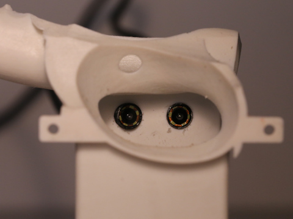
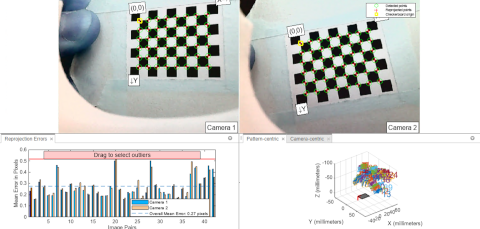
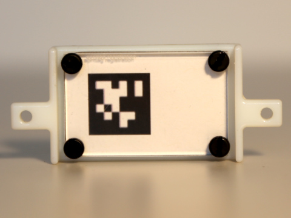
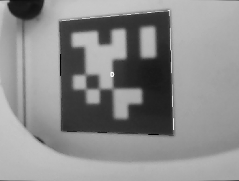
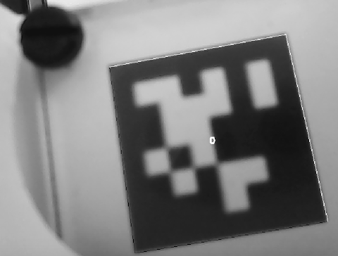
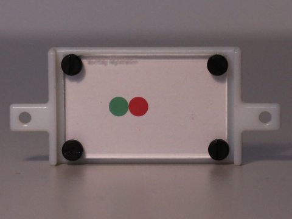
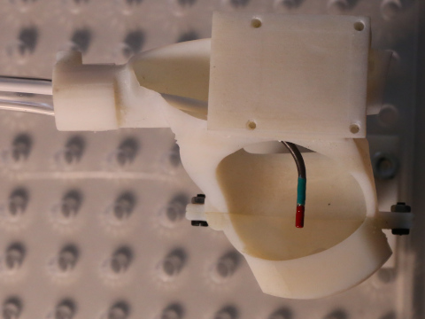
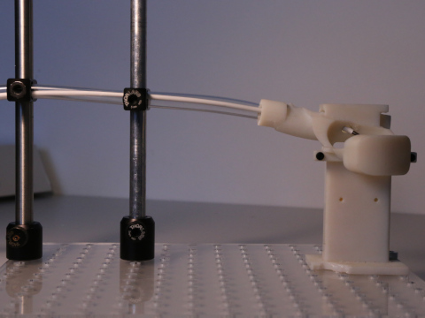

# Robotic Catheter Ablation: An Evaluation and Prototyping Platform

## Stereo Camera Setup
The two endoscopic cameras are placed in the main part of the physical setup as follows:
 

To stream the two cameras, we utilze the [usb_cam](http://wiki.ros.org/usb_cam) package in ROS noetic. The following launch file starts the two cameras and publishes the video streams to `stereo_cam_right/image_raw` and `stereo_cam_left/image_raw`:
```xml
<launch>
    <!-- Arguments -->
    <arg name="frame_rate" default="25" />
    <arg name="pixel_format" default="yuyv" />

    <!-- Launch right camera -->
    <node name="stereo_cam_right_node" pkg="usb_cam" type="usb_cam_node">
        <param name="camera_name" value="stereo_cam_right" />
        <param name="camera_frame_id" value="/stereo_cam_right" />
        <param name="video_device" value="/dev/<PATH_RIGHT_CAMERA>"/>
        <param name="pixel_format" value="$(arg pixel_format)" />
        <param name="framerate" value="$(arg frame_rate)" /> 
    </node>

    <!-- Launch left camera -->
    <node name="stereo_cam_left_node" pkg="usb_cam" type="usb_cam_node">
        <param name="camera_name" value="stereo_cam_left" />
        <param name="camera_frame_id" value="/stereo_cam_left" />
        <param name="video_device" value="/dev/<PATH_LEFT_CAMERA>"/>
        <param name="pixel_format" value="$(arg pixel_format)" />
        <param name="framerate" value="$(arg frame_rate)" /> 
    </node>
</launch>
```
### Stereo Camera Calibration
To get the intrinsic and extrinsic parameters of the two cameras, we utilize the Matlab's [Stereo Camera Calibrator](https://www.mathworks.com/help/vision/ug/using-the-stereo-camera-calibrator-app.html):


### April Tag Registraion


```xml
    <!-- Arguments -->
    <arg name="camera_name_left" default="/stereo_cam_left" />
    <arg name="camera_name_right" default="/stereo_cam_right" />
    <arg name="apriltag_definition_file" default="<PATH_TO_DEFINITION>" />
    <arg name="apriltag_settings_file" default="<PATH_TO_SETTINGS>" />
    
    <!-- Launch AprilTag detection right camera -->
    <group ns="$(arg camera_name_right)"> 
        <node pkg="image_proc" type="image_proc" name="image_proc" />
        <node pkg="apriltag_ros" type="apriltag_ros_continuous_node" name="apriltag_right_cam" clear_params="true" output="screen">
            <rosparam command="load" file="$(arg settings_file)" />
            <rosparam command="load" file="$(arg tags_file)" />
            <param name="camera_frame" type="str" value="$(arg camera_name_right)" />
        </node>
    </group>

    <!-- Launch AprilTag detection left camera -->
    <group ns="$(arg camera_name_left)"> 
        <node pkg="image_proc" type="image_proc" name="image_proc" />
        <node pkg="apriltag_ros" type="apriltag_ros_continuous_node" name="apriltag_left_cam" clear_params="true" output="screen">
            <rosparam command="load" file="$(arg settings_file)" />
            <rosparam command="load" file="$(arg tags_file)" />
            <param name="camera_frame" type="str" value="$(arg camera_name_left)" />
        </node>
    </group>
```

 


### Accuracy Evaluation
 

## GUI
### Load heart model
### Static transformation

## Physical setup
 

 


## Reference
For more detailed instructions, the reader is refered to the following publication:
```
@inproceedings{Heemeyer2023,
  doi = {10.1109/ismr57123.2023.10130271},
  url = {https://doi.org/10.1109/ismr57123.2023.10130271},
  year = {2023},
  month = apr,
  publisher = {{IEEE}},
  author = {Florian Heemeyer and Christophe Chautems and Quentin Boehler and Jos{\'{e}} L. Merino and Bradley J. Nelson},
  title = {An Evaluation Platform for Catheter Ablation Navigation},
  booktitle = {2023 International Symposium on Medical Robotics ({ISMR})}
}
```
